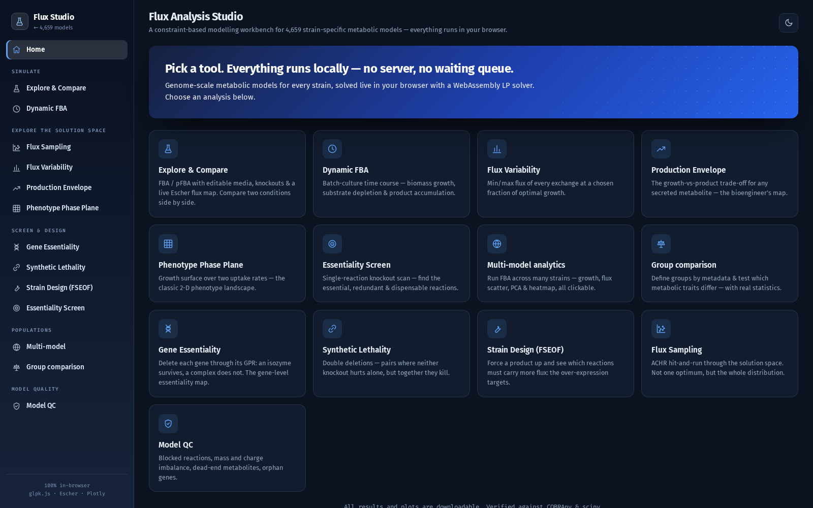
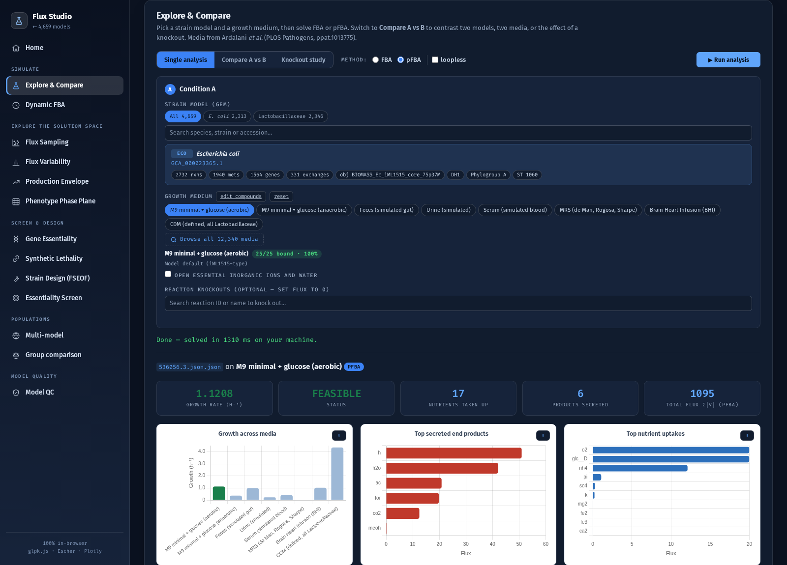
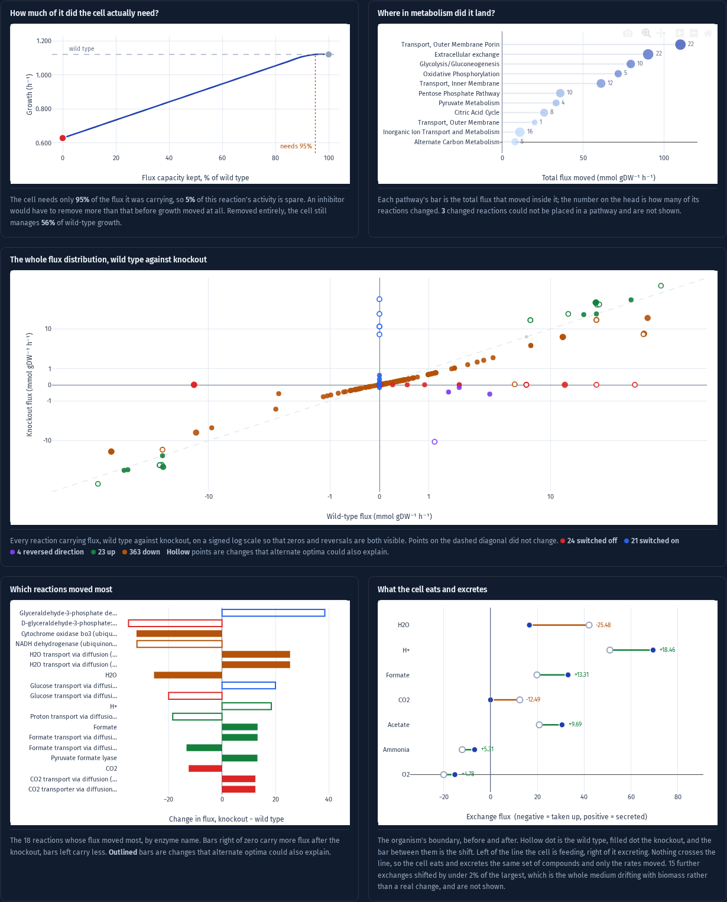
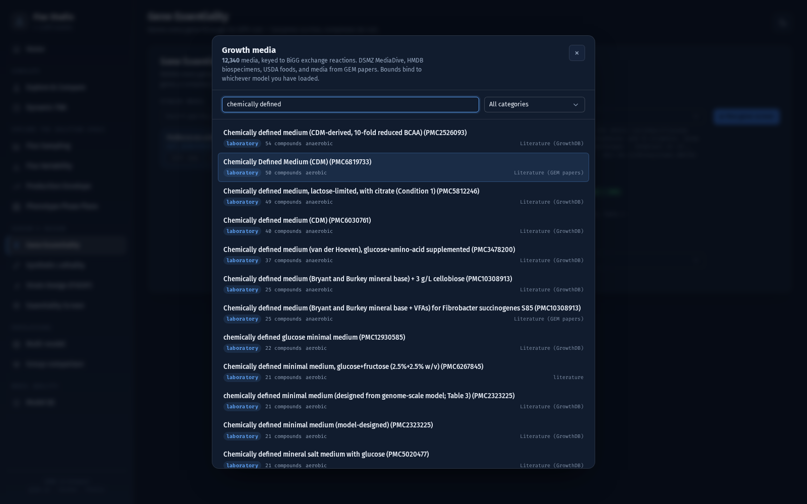

# Flux Studio

**Constraint-based metabolic modelling, in your browser. No install, no server, no queue.**

<a href="https://omidard.github.io/FluxStudio/">
  
</a>

<a href="https://omidard.github.io/panGEMs/"></a>
<a href="https://omidard.github.io/Media/"></a>

Pick a strain, pick a growth medium, and solve. Thirteen analyses, from flux balance
analysis to synthetic lethality to strain design, over **4,659 genome-scale metabolic
models** (2,313 *Escherichia coli* and 2,346 Lactobacillaceae) and **12,340 curated
growth media**. The linear program is solved in your browser tab by a WebAssembly build
of GLPK: your models and your media never leave your machine.

Every result is checked against COBRApy 0.27.

---

| | |
|:--:|:--:|
|  |  |
| **Thirteen analyses** | **Solve, and see the flux map** |
|  |  |
| **Knockout: what changed, and is it real** | **12,340 media, in every analysis** |

---

## What it does

**Simulate** — FBA · parsimonious FBA · linear MOMA · loopless flux (CycleFreeFlux) ·
dynamic FBA

**Explore the solution space** — flux sampling (ACHR) · flux variability · production
envelopes · phenotype phase planes

**Screen and design** — reaction essentiality · gene essentiality (through the GPR rules,
so isozymes survive and complexes do not) · synthetic lethality (double deletions) ·
FSEOF strain design

**Compare** — two conditions side by side · multi-model analytics · group comparison

**Model quality** — blocked reactions, mass and charge imbalance, dead ends, orphan genes

### The knockout study

Knock out any set of reactions and see the wild type and the mutant solved on the same
medium: growth before and after, two Escher maps, and five figures that each answer a
different question. **How much of the reaction did the cell actually need** (a titration,
because a knockout is one point on a curve). **Where in metabolism the damage landed.**
**The whole flux redistribution** on one signed-log scatter, so reversals and on/off are
both visible. **Which reactions moved**, by enzyme name. **What the cell now eats and
excretes.**

And one thing most tools skip: **a flux-difference plot is a lie if the fluxes came from
plain FBA.** Many flux vectors give exactly the same growth rate and the solver returns an
arbitrary one, so diffing two arbitrary choices draws re-routing that is solver noise.
Every change named here is checked by running FVA on *both* states. If a reaction's
feasible range at the wild-type optimum is disjoint from its range at the knockout
optimum, the knockout forces the change and it is real. If the ranges overlap, the plot
says so and draws the point hollow. On a *PGI* knockout in *E. coli* DH1, only 21 of the
40 largest changes survive that test. Nineteen were the solver choosing.

## What it cannot do, and will not pretend to

glpk.js exposes a **linear** program only: no integer variables, no quadratic objective.
So **ROOM**, exact `add_loopless`, gap-filling and **OptKnock** (which need MILP) and
**quadratic MOMA** (which needs QP) are absent rather than faked. Linear MOMA is the form
COBRApy uses for large models anyway, and CycleFreeFlux gives the same loop-free flux
distribution as `add_loopless` at the same growth rate.

## Validated against COBRApy 0.27

Same model, same medium, run in the browser and diffed against a Python reference:

| | COBRApy 0.27 | Flux Studio |
|---|---|---|
| Growth (FBA) | 1.120796 | 1.120796 |
| Essential genes | 5 | 5 (identical set, max diff 4.6e-11) |
| Linear MOMA distance | 62.1449 | 62.1451 |
| Loopless growth | 1.120796 | 1.120796 |
| Blocked reactions | 14 | 14 |
| Knockdown titration | 21 points | max diff 4.8e-07 |
| Alternate-optima verdict | 21 forced / 19 ambiguous | 21 / 19 |

## Link straight into an analysis

Any page can hand a specific strain to a specific analysis, which is how the model
browsers do it:

```
https://omidard.github.io/FluxStudio/?model=<gem_file>
                                     &tab=<analysis>     explore | fva | dfba | sampling |
                                                         envelope | phaseplane | genes |
                                                         synlethal | design | essential |
                                                         multi | cohort | qc
                                     &medium=<preset>    M9_glucose_aerobic | M9_glucose_anaerobic |
                                                         MRS | BHI | CDM | Feces | Urine | Serum
                                     &ko=<rxn,rxn>       preload a knockout study
```

```
?model=536056.3.json.json&ko=ATPS4rpp            knock out ATP synthase in E. coli DH1
?model=GCF_020539925.1.json&tab=genes&medium=CDM gene essentiality in Pediococcus on CDM
?models=a.json,b.json,c.json                     compare three strains
```

`gem_file` is the key used by
[gems_metadata.json](https://omidard.github.io/panGEMs/gems_metadata.json).

## Where the data comes from

Flux Studio ships no data. It reads, at run time:

- **[panGEMs](https://github.com/omidard/panGEMs)** — the 4,659 strain models, from
  [EcopanGEM](https://github.com/omidard/EcopanGEM) and
  [LactoPanGEM](https://github.com/omidard/LactoPanGEM)
- **[Media](https://github.com/omidard/Media)** — 12,340 curated growth media, keyed to
  BiGG exchange reactions, from DSMZ MediaDive, HMDB, USDA, FooDB and the primary
  literature

The two pangenomes were built a decade apart and **use different BiGG naming
generations**: EcopanGEM writes `EX_glc__D_e`, LactoPanGEM writes `EX_glc_D_e`. A medium
that names an exchange the model does not have is a *closed* exchange, so binding an
E. coli medium to a Lactobacillus model would silently delete glucose and every amino
acid, and the strain would read as dead. Flux Studio resolves across both spellings and
always shows you the coverage, because an unbound compound is not a cosmetic miss: it is a
removed nutrient.

## Notes on the biology

Lactobacillaceae are fastidious. **None** of the LactoPanGEM strains grow on M9 + glucose,
and only about half on MRS or BHI. They need amino acids, nucleotides and vitamins. The
default medium for that collection is therefore **CDM**, the chemically defined medium from
the LactoPanGEM paper (Table 2), on which **16 of 16 strains tested grow**.

## Architecture

```
docs/
  index.html            the app
  fba/
    fba_engine.js       LP construction and every analysis; no DOM
    fba_ui.js           Explore, Compare, Knockout study
    ko_plots.js         the five knockout figures + the alternate-optima check
    studio.js           the other ten analyses
    media.js            Media database client
    media_ui.js         the shared media picker, mounted on every analysis
    media_presets.json  eight quick presets
    subsystems.json     BiGG reaction to pathway
    core_map.json       Escher map
  vendor/               glpk.js (WASM), Escher, Plotly
```

Everything is a plain ES module. There is no build step.

## Cite

If Flux Studio is useful in your work, please cite the models it runs on:

- Ardalani O., Phaneuf P.V., Mohite O.S., Nielsen L.K. *Pangenome reconstruction of
  Lactobacillaceae metabolism predicts species-specific metabolic traits.* **mSystems**
  9(7):e00156-24 (2024). doi:[10.1128/msystems.00156-24](https://doi.org/10.1128/msystems.00156-24)
- Ardalani O. *et al. Annotating the pangenome reveals the diversity in the genetic basis
  for metabolic enzymes.* **Science Advances** 12(27) (2026).
  doi:[10.1126/sciadv.aeb3363](https://doi.org/10.1126/sciadv.aeb3363)

## Licence

MIT. Escher, Plotly and glpk.js are vendored under their own licences.
